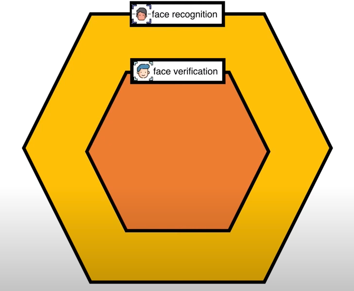
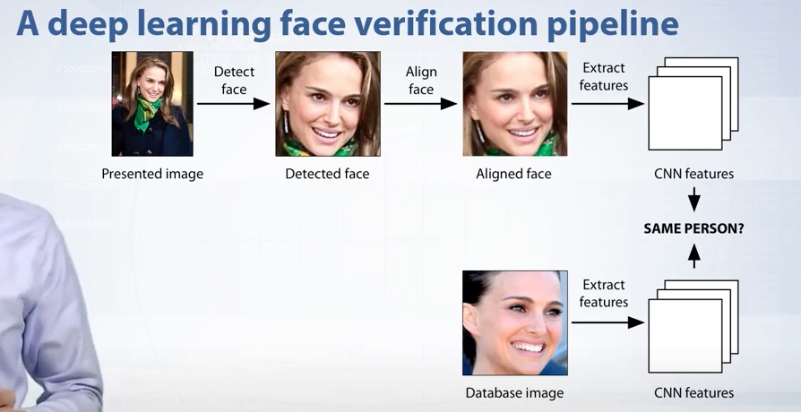
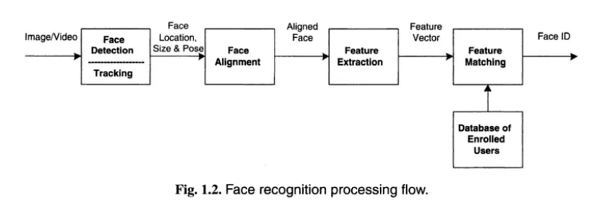

# preparation_phase
Preparation phase of the online proctoring system including identity verification

## Facial Verification คืออะไร
- Facial Verification คือ ระบบสแกนใบหน้าที่จะทำการประมวลผลเพื่อเปรียบเทียบภาพสองภาพในขั้นตอนการตรวจจับใบหน้าเพื่อยืนยันตัวบุคคล เช่น การสแกนภาพในวีซ่ากับภาพใบหน้าปัจจุบันเพื่อยืนยันตัวตนเข้าระบบ หรือ การสแกนภาพในบัตรประชาชนกับภาพใบหน้าปัจจุบัน เพื่อเข้าระบบบัญชีธนาคาร หรือภาพในฐานข้อมูลกับภาพถ่ายจากกล้องหน้าประตูเพื่อทำการอนุญาตให้เข้าถึงพื้นที่ในอาคาร เป็นต้น
- A one-to-one mapping of a given face against a known identity (e.g. is this the person?).

### Pipeline [Link reference](https://medium.com/backprop-labs/face-recognition-pipeline-clearly-explained-f57fc0082750)

**There are four major stages**:
1. Face Detection
2. Face Alignment
3. Feature Extraction
4. Feature Matching

#### Face Detection [Link reference](https://learnopencv.com/face-detection-opencv-dlib-and-deep-learning-c-python/)

A Face detection method is used to find the faces present in the given image, extract faces if exist, and crop the face only to create a compressed file for further feature extraction. There are multiple algorithm options to perform this task in a face detection/recognition system.

1. **Haar cascade Face Detection**: Haar Cascade based Face Detector was the state-of-the-art in Face Detection for many years since 2001 when it was introduced by Viola and Jones in their paper, “Rapid Object Detection using a Boosted Cascade of Simple Features”. There have been many improvements in recent years. This method has a simple architecture that works nearly real-time on the CPU. Also, it can detect images at different scales. But the major drawback is that it gives false results as well as it doesn’t work on non-frontal images.
2. **Dlib (HOG) Face Detection**: This is a widely used face detection model, based on HoG features and SVM published in 2005 in the paper “Histograms of oriented gradients for human detection”. HOG, or Histogram of Oriented Gradients, is a feature descriptor that is often used to extract features from image data. It is the fastest method on CPU which can work on frontal and slightly no-frontal images. But it is incapable of detecting small images and handling occlusions. Also, it often excludes some parts of the chin and forehead while detection.
3. **Dlib (CNN) Face Detection**: This method first introduced in the 2016 paper “CNN based efficient face recognition technique using Dlib” uses a Maximum-Margin Object Detector ( MMOD ) with CNN based features. The training process for this method is very simple and you don’t need a large amount of data to train a custom object detector. It works very fast on GPU and is capable to work for various face orientations in images. It can also handle occlusions. But the major disadvantage is that it is trained on a minimum face size of 80*80 so it can’t detect small faces in images. It is also very slow on the CPU.
4. **MTCNN Face Detection**: Multi-task Cascaded Convolutional Networks (MTCNN) is a framework developed as a solution for both face detection and face alignment. This method was first introduced in a paper named “Joint Face Detection and Alignment using Multi-task Cascaded Convolutional Networks” in 2016. This method gives the most accurate results out of all the four methods. It works for faces having various orientations in images and can detect faces across various scales. It can even handle occlusions. It doesn’t hold any major drawback as such but is comparatively slower than HOG and Haar cascade method.

#### Face Alignment [Link reference](https://sefiks.com/2020/02/23/face-alignment-for-face-recognition-in-python-within-opencv/)
Face alignment is an early phase of the modern pipeline of face recognition. Google has reported that face alignment improves the accuracy of its FaceNet face recognition model from 98.87% to 99.63%. This is an increase in accuracy of almost 1 percent. We can easily apply 2D face alignment inside OpenCV in Python. With haar cascade configurations in OpenCV has modules for both frontal face and eye detection. Extracting the eye locations is very important to align faces. OpenCV finds eye locations with conventional haar cascade method. After getting the eye location of the detected face you can rotate the image 1 degree until both eyes are horizontal. This will increase the complexity of the solution so you can align the face based on angles between two eyes using the cosine rule. MTCNN also finds some facial landmarks such as eye, nose, and mouth locations. If we are using MTCNN in the face recognition pipeline it will automatically do an alignment to the face detected.

#### Feature Extraction
Feature extraction is the basic and most important initializing step for face recognition. It extracts the biological components of your face. These biological components are the features of your face that differ from person to person. There are various methods which extract various combination of features, commonly known as nodal points. No two people can have all the nodal points similar to each other except for identical twins.

These advances have been powered by four milestone systems for deep learning for face recognition: *DeepFace, the DeepID series of systems, VGGFace, and FaceNet.*

1. **VGGFace**: The VGG-Face CNN descriptors are computed using our CNN implementation based on the VGG-Very-Deep-16 CNN architecture and are evaluated on the Labeled Faces in the Wild and the YouTube Faces dataset. VGG uses various architectures such as VGGFace1, VGGFace2 by Keras. The basic difference among these models is the number of layers included in its architecture that varies from model to model. These models have quite good accuracy.

2. **FaceNet**: FaceNet is a face recognition system developed in 2015 by researchers at Google in their 2015 paper titled “FaceNet: A Unified Embedding for Face Recognition and Clustering”, that achieved then state-of-the-art results on a range of face recognition benchmark datasets and presented an innovation called ‘triplet loss‘ that allowed images to be encoded efficiently as feature vectors that allowed rapid similarity calculation and matching via distance calculations. The FaceNet system can be used broadly thanks to multiple third-party open-source implementations of the model and the availability of pre-trained models. The FaceNet system can be used to extract high-quality features from faces, called face embeddings, which can then be used to train a face identification system.

3. **DeepFace**: DeepFace is a system based on deep convolutional neural networks. It was described in the 2014 paper titled “DeepFace: Closing the Gap to Human-Level Performance in Face Verification.” It was perhaps the first major leap forward using deep learning for face recognition, achieving near human-level performance on a standard benchmark dataset.

4. **DeepID (Deep hidden IDentity features)**: The DeepID is a series of systems (e.g. DeepID, DeepID2, etc.), first described by Yi Sun, et al. in their 2014 paper titled “Deep Learning Face Representation from Predicting 10,000 Classes.” Their system was first described much like DeepFace, although was expanded in subsequent publications to support both identification and verification tasks by training via contrastive loss. The DeepID systems were among the first deep learning models to achieve better-than-human performance on the task.

#### Feature Classification
The final stage of face detection technology is to make a decision whether the face’s features of a new sample are matching with the one from a facial database or not. These template-based classifications are possible using various statistical approaches. It usually takes just seconds.

1. **Euclidean Distance**: It is a distance-based feature classification method that calculates the distance between the facial nodes and the face which has the minimum difference between these distance values is considered to be the match. But it is suitable for the datasets having a smaller number of classes and lower-dimensional features.
2. **Cosine Similarity**: In cosine similarity, the solution that we obtain after calculating the cosine of an angle is brought into concern. Here, we would compare the differences between these results. The more the value is closer to 1, the greater is the probability of the match. But it may give a false result if the test data features are incomplete.
3. **SVM (Support vector machine)**: SVM creates an optimal hyperplane to classify the classes of the training dataset based on the different features of the face. The dimensionality of the hyperplane is one less than the number of features. Different kernels can be applied to see what features are used by the classifier to remove the features if required. This can help to improve speed.
4. **KNN (K-Nearest Neighbor)**: KNN is all about the number of neighbors i.e. the k value. In KNN, if k=3 then we check that the data is close to which 3 data points. Thereafter, it is decided that the majority of the closest data points belong to which class. Now, the test data is predicted to be in this class KNN has a curse of dimensionality problem which can be solved by applying PCA before using the KNN classifier. You can get a better understanding of KNN
5. **ANN (Artificial Neural Network)**: ANN uses a very detailed algorithm for face recognition. It classifies the local texture using a multi-layer perceptron for face alignment. It uses a geometric feature-based and independent component analysis for feature extraction and multi artificial neural network for feature matching.

## Research gap
- Detecting whether it's the face from `Deepfake` or not.
- Verify FACE ID even the user is wearing a glasses.

[ ] Set up verification images

[ ] Build verification function

[ ] Perform verification in real time